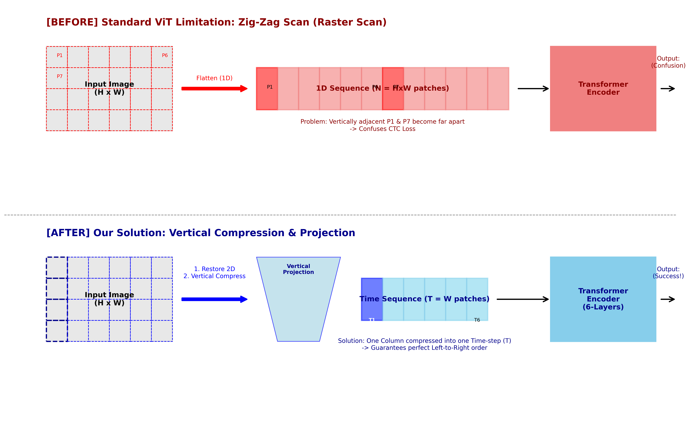

# SheetOCR
Transformer Encoder + YOLOv8로 OCR을 구현해봅시다.  
대충 YOLOv8로 악보의 제목 위치를 잡은 다음, 글자 리스트에서 Transformer Encoder가 글자를 찾으면 되지 않을까? 라는 생각에서 진행된 프로젝트입니다.  

## 서론

이 프로젝트는 "악보에서 YOLOv8로 제목의 위치를 찾아 자르고 그걸 Transformer Encoder로 글자를 읽어낼 수 없나?" 라는 의문에서 시작했습니다. 기존의 일반적인 Visual Transformer(ViT) 구조가 가진 한계점을 분석하고 악보/텍스트 데이터의 시계열적 특성에 맞게 모델을 최적화한 연구 기록입니다.

## 문제점

* 기존 ViT의 Scan 방식(지그재그로 나열해서 하는 방법)이 가로로 긴 텍스트 인식에 좋지 않은 성능을 냄
  * 그 이유로 초기 정확도가 70%대에서 올라가지 못함

## 해결 방안
* 추론 단계에서 이미지 비율이 깨지는 문제를 방지하기 위해 비율을 유지하며 여백을 채우는 리사이즈 방식으로 진행

* 기존의 지그재그와는 다르게 세로 패치를 하나로 압축하여 시계열 데이터 보존(Vertical Flattening)
* Hard Augmentation: Gaussian Blur, Rotation 등을 이용하여 강건한 모델 학습

### 왜 기존의 지그재그 방법은 작동하지 않는가?

## TroubleShooting
* 공백 문자 소실 문제와 Vocab 처리

## 성능
Validation Acc 92.1% 달성

### 실험 조건
* 200 Epoch
* WSL + CUDA (RTX 5070 Ti)
